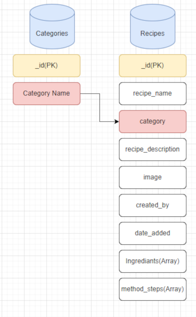
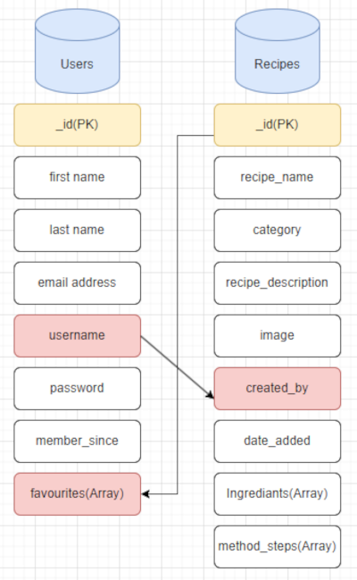

# Veg-Centric Recipes

# A responsice web application for Users to view and share Veg-Centric recipes.

## Code Intstitute - Milestone Project 3

## HTML / CSS / Jquery / Python / Flask / MongoDB / Materialize / Cloudinary / Heroku

### By Joe Seabrook

N.B am i responsive images here

### Repository Link

[View in GitHub Pages](https://github.com/Jaycode88/veg-centric-msp3)

### Live Project Link

[View Deployment Link](https://veg-centric-msp3-64721c5e710e.herokuapp.com/welcome)

# Content

- ## The Why

Veg-Centric Recipes addresses a growing need for economical and sustainable dining options. As people seek ways to reduce food costs, we recognize that incorporating more vegetables into meals is not only healthier but also more budget-friendly than heavy meat-based dishes. We're here to show that delicious, wallet-friendly meals can be centered around vibrant veggies.

- ## Business Goal

- Expand our user base to build a thriving community.

- Gain revenue streams through advertising opportunities and affiliate marketing partnerships, enabling us to continue offering valuable resources and content to our users.

- ### User Stories

    - #### First-Time User Goals

        - Enjoy a User-Friendly Experience: A user-friendly interface and navigation system that allows users to easily explore the website and discover recipes and resources.

        - Browse Veg-Centric Recipes: Users will want to discover simple and time-efficient vegetable-based recipes for their meals.

        - Discover New Flavors and Ingredients: Users may have a goal of expanding their culinary horizons by trying out new vegetables and flavors they haven't cooked with before.

        - Join the community: A User may want to join the community and share their own recipes

        - Find information about Veg-Centric.

    - #### Returning User Goals

        - Contribute to the Community: Enable returning users to actively contribute to the community by sharing their own veg-centric recipes.

        - Save Favorite Recipes: Allow users to save their favorite veg-centric recipes to their profile for easy access on return visits.

        - To be able to view, edit and Delete their uploaded recipes.

        - To have a page with user information with the option to update.

    - #### Website Owner Goals

        - Edit all Recipes to remove speling errors, make easier to understand etc

        - Edit recipe images for aesthetical purposes.

        - The ability to add Categories.

        - Generate revenue Through Affiliate Marketing.

## THE 5 PLANES
- ### Strategy

    - **Purpose of the website?**

        Provide a diverse and accessible collection of veg-centric recipes, cooking tips, and resources to inspire and assist users in their culinary journey.

    - **Target audience?**

        * Home Cooks and Food Enthusiasts: Those who enjoy cooking and are looking for creative, vegetable-centric recipes that offer both flavor and nutrition.

        * Health-Conscious Consumers: Individuals who prioritize their health and are seeking ways to incorporate more vegetables into their diets for improved well-being.

        * Budget-Conscious Shoppers: People who are mindful of their food expenses and are interested in cost-effective meal options that don't compromise on taste or nutrition.

    - **Value to the user?**

        * Economical Dining Solutions: We empower users to save money on their food expenses by sharing budget-friendly veg-centric recipes that prove that healthy eating doesn't have to break the bank.

        * Inspiration for Healthier Living: The platform inspires users to make healthier dietary choices by showcasing the nutritional benefits of vegetable-centric meals, helping them achieve their wellness goals.

        * Community and Connection: We foster a vibrant and supportive community where users can connect with like-minded individuals, share their culinary experiences, and exchange ideas for veg-centric living.

    - **What makes a good experience ?**

      * User-Friendly Interface: A well-designed and intuitive interface that is easy to navigate, ensuring that users can find and upload recipes.

      * Responsive Design: A website that adapts seamlessly to various devices and screen sizes, ensuring a consistent and enjoyable experience whether users are on desktop, tablet, or mobile.

      * Search Option: Robust search feature that allow users to find specific recipes by Name, Category and User.

      * Accessibility: Ensuring that the website is accessible to users with disabilities, including features like alt text for images and keyboard navigation.

      * Community Engagement: A vibrant and active community where users can share their own recipes with others who share their interests.

    - **What we shouldn't do?**

        * Spam or Over-Promotion: We do not engage in spammy practices, including excessive advertising, unsolicited emails, or intrusive pop-ups that disrupt the user experience.

        * Misleading Information: We do not provide misleading or inaccurate information, especially regarding health, nutrition, or the environmental impact of food choices.

        * Plagiarism: We do not plagiarize content from other sources. All content on our platform is original, properly attributed, and respects copyright laws.

        * Neglecting User Privacy: We do not compromise user privacy by sharing or selling personal information without consent. We adhere to strict privacy policies to protect user data.

## Design
- ### Theme and Color Scheme
    Green And Goldenrod:
    This pallete Consists of the colors Olive Green (#5A873C), Apple Green (#8ABD4D) and Pale Goldenrod (#DED8A0).

- #### **Color by Color:**
    Below is the Physcology of each color and its relation to food.

- **Olive Green**
    - Earthy and Sophisticated: Olive green is often associated with earthiness and sophistication. It's reminiscent of olive trees and has a muted, subdued quality.

    - Stability and Endurance: This shade of green can convey a sense of stability and endurance, making it suitable for products or environments that want to project reliability.

    - Military and Utility: Due to its use in military uniforms and utilitarian equipment, olive green can also evoke feelings of strength, resilience, and preparedness.

- **Olive Green in relation to food**
    -   Olive green may be associated with earthy and savory flavors. It's often found in Mediterranean cuisine due to its connection with olives. It can also be used in packaging or decor to suggest a more mature or refined culinary experience.

- **Apple Green**
    - Vibrancy and Freshness: Apple green, or bright green, is associated with vibrancy, freshness, and youthfulness. It's often used to create a lively and energetic atmosphere.
    
    - Creativity and Innovation: This shade of green can stimulate creativity and innovation. It's often used in marketing to catch attention and convey a sense of excitement.

    - Positive and Playful: Apple green is a playful and positive color. It can evoke feelings of happiness and cheerfulness, making it suitable for products and designs aimed at children or those seeking a fun experience.

- **Apple Green in relation to food**
    - Health and Natural Foods: Like other shades of green, apple green is linked to health and natural foods. It can be used to suggest that a product is fresh, organic, and good for you.

    -  Bright green is frequently used in marketing fresh and vibrant foods, such as green apples, limes, and kiwis. It can make food appear more appealing, especially if the goal is to convey a sense of freshness and healthiness.

- **Research of green used by Food Companys and Authoritys**
    - Upon research into the use of the color green within in the food sector I found many large companies and Authorities Use this color in different shades in their logos and marketing, Including 2 recipe websites.


- **Pale Goldenrod**

     Whilst this colour is not normally considered in the normal mushroom range of colours I chose it due to it closeness to the mushroom range without the grey hue which can cause slight visibility problems with text, yet still holds the earthy undertones of mushroom. This color offers:

     - Warmth: #DED8A0 is a warm color with yellow undertones. Warm colors are often associated with feelings of comfort and positivity.

     - Cheerfulness: The goldenrod hue in #DED8A0 can evoke feelings of cheerfulness and optimism.

     - Earthiness: This color has earthy qualities, which can convey a sense of stability and groundedness.

     - Subtlety: It's a relatively muted color, suggesting a sense of understated elegance and calmness.

- **Pale Goldenrod in relation to food**
    - Natural and Wholesome: This color has earthy qualities, making it suitable for describing foods that are natural, organic, and wholesome. Think of fresh produce from a farmer's market.

    - Warm Desserts: In the realm of desserts, #DED8A0 might be likened to the golden-brown crust of a freshly baked pie or the warm, inviting color of a bread pudding. It conveys a sense of indulgence.

- ### Design Brief:
- **Color:**


- **Background:**
In This design, I have chosen a white background as the primary canvas for several compelling reasons:
    - Cleanliness and Freshness: White is universally associated with cleanliness and freshness. It provides a pristine and uncluttered visual canvas that conveys a sense of purity and simplicity. This choice aligns with our goal of presenting a clean and inviting user interface.

    - High Readability: White backgrounds offer excellent contrast for text, ensuring that content is highly readable. This is especially important for user interfaces where readability plays a crucial role in user engagement and understanding.

    - Timelessness: White backgrounds have a timeless quality. They don't go out of style and can provide a neutral backdrop that allows other design elements to shine. This ensures that our design remains relevant and appealing over time.

To complement the white background, I've introduced pale goldenrod cards (#DED8A0) strategically in certain sections of the interface. These cards serve several purposes:
- Visual Interest: The pale goldenrod color adds a touch of warmth and visual interest to the design, breaking up the monotony of an all-white interface and creating focal points for important content.

- Subtle Elegance: The muted golden-yellow hue of the cards conveys a sense of understated elegance and sophistication, enhancing the overall aesthetic appeal.

- Information Hierarchy: We use pale goldenrod cards to highlight specific sections or content, helping users quickly identify and engage with key information.

- ## Typography
 #### Font Choices
In designing this project, I carefully selected fonts to convey the desired visual identity and user experience. My font choices are as follows:
   - **Playfair Display (Logo and Headings)**

- *Psychology*: Playfair Display is a serif font known for its elegance and sophistication. It carries a sense of tradition and classicism, making it an excellent choice for logos and headings. The distinctive serifs and high contrast between thick and thin strokes create a sense of luxury and refinement, aligning with the project's premium and professional aesthetic.

- **Alice (Body Text)**

- *Psychology*: Alice is a modern and legible sans-serif font. It offers a clean and friendly appearance, making it an ideal choice for body text. The simplicity and readability of Alice ensure that users can comfortably consume content without distraction. This font choice promotes a user-friendly experience, enhancing readability and accessibility. 

 #### Fallback Font
 As a best practice, I have also included a fallback font in The design. In cases where browsers or devices may not support the specific fonts mentioned above, we use a generic sans-serif font. This ensures that the text remains legible and maintains a consistent appearance across various platforms.

Our font choices, including the fallback option, reflect the project's personality and goals, combining elegance with readability to create an engaging and visually appealing user interface.

- ## Wireframes
The basic layout of Veg-Centric Recipes was created with [Balsamiq](https://balsamiq.com/).


- ## High Fidelity Prototype
The Prototype for the main page was made with [Figma](https://www.figma.com/)


- ## Features
 - #### Navigation Bar
    - The navigation bar is a central feature that enhances the user experience by providing easy access to key functionalities and content within Veg-Centric.  Whether on a desktop or a mobile device, users can seamlessly navigate through the application with the help of this feature.

    - The Nav Bar consist of: The Brand Logo which when clicked directs the user to the homepage, Top bar Navigation for larger screens and Dropdown Nav for Mobile decvices.

    -  Depending on the user's role and session status, the Nav Bar & Dropdown provide a set of relevant links for easy navigation


 - #### Footer Bar
    - The footer bar in our web application, Veg-Centric, is a helpful component that appears at the bottom of each page. The Footer bar acknowledges the developer behind the project, and offers links to the developer's GitHub and LinkedIn profiles. This promotes transparency, user engagement, and a seamless browsing experience for our users.


- #### Recipe Search
    - The search feature enhances the user experience by providing a tailored way to find recipes that match their preferences. Users can quickly filter through a large collection of recipes and discover the ones that align with their culinary interests.

    - The search form was created with [Materialize](https://materializecss.com/)


- #### Recipe Cards
    - Recipe cards are the visual representation of individual recipes within our web application. Each recipe card provides a comprehensive overview of a specific recipe, allowing users to quickly assess its details, category, and more.

    - The recipe cards are designed to offer a visually pleasing and user-friendly experience. They provide a quick and convenient way for users to browse through our recipe collection, find dishes of interest, and take actions based on their preferences.


- #### Recipe Details page
    - The Recipe Details Page offers users a rich and informative experience, enabling them to explore recipes in detail

    - It encourages user interaction by offering the option of adding to favorites.


- #### Sign In and Sign Up
    - I added a Sign up Feature so users can upload their own recipes.

    - Users that are signed Up and Signed in are able to save favourite recipes aswell as edit and delete their own recipes.


- #### Profile Page
    - The Profile Page enhances the user experience by centralizing user-related information and actions. It allows users to manage their profile, access their uploaded recipes, and easily revisit their favorite recipes. Additionally, it provides a sense of ownership and engagement within the Veg-Centric community.


 - ## Future Features I would like to include
    - #### create point for each feature
    And decribe below

- ## **DATABASES**

- **Models Flow Chart**

- #### Categories and Recipes



- #### Recipes and Users



## **TESTING**

For the documentation of all testing,Please see TESTING.md(TESTING.md) 

## **DEPLOYMENT**
- ### Local Deployment
This project can be cloned or forked in order to make a local copy on your own system.

- #### Cloning
    You can clone this repository by following these steps:

    1. Go to the [GitHub repository](https://github.com/Jaycode88/veg-centric-msp3) 
    2. Locate the Code button above the list of files and click it 
    3. Select if you prefer to clone using HTTPS, SSH, or GitHub CLI and click the copy button to copy the URL to your clipboard
    4. Open Git Bash or Terminal
    5. Change the current working directory to the one where you want the cloned directory
    6. In your IDE Terminal, type the following command to clone my repository:
        - `git clone https://github.com/Jaycode88/veg-centric-msp3.git`
    7. Press Enter to create your local clone.

    Alternatively, if using Gitpod, you can click below to create your own workspace using this repository.

[](https://gitpod.io/#https://github.com/Jaycode88/veg-centric-msp3)

Please note that in order to directly open the project in Gitpod, you need to have the browser extension installed.
A tutorial on how to do that can be found [here](https://www.gitpod.io/docs/configure/user-settings/browser-extension)

- #### Forking
    By forking the GitHub Repository, we make a copy of the original repository on our GitHub account to view and/or make changes without affecting the original owner's repository.
    You can fork this repository by using the following steps:

    1. Log in to GitHub and locate the [GitHub Repository](https://github.com/Jaycode88/veg-centric-msp3)
    2. At the top of the Repository (not top of page) just above the "Settings" Button on the menu, locate the "Fork" Button.
    3. Once clicked, you should now have a copy of the original repository in your own GitHub account!

 - **Running Locally**

    After you have cloned or forked the repository and navigated to the project directory, you can set up your local environment as follows:

    1. **Install Dependencies**: Make sure you have Python 3.x installed on your system. Then, install the required dependencies listed in the `requirements.txt` file:

        ```  
        pip install -r requirements.txt
        ``` 

    2. **Configure Environment Variables**: If your application requires environment variables, create a `.env` file in the project directory and add the necessary variables.

    3. **.gitignore File**: Ensure that you have a `.gitignore` file in your project to exclude sensitive information and files from being committed to version control. Common entries in a `.gitignore` file include `.env`, `.pyc` files, and other temporary or generated files.

    4. **Run the Application**: Start the local development server using the following command:

        ```
        python3 app.py
        ```

        Replace `app.py` with the actual name of your main application file.

- ### Deployment with Heroku
    This application can be deployed on Heroku to make it accessible on the web. Follow these steps to deploy your app:

    - #### Prerequisites

        Before deploying the app on Heroku, make sure you have the following prerequisites:

        1. [Heroku Account](https://signup.heroku.com/) - You need a Heroku account to deploy your app.
        2. [Heroku CLI](https://devcenter.heroku.com/articles/heroku-cli) - Install the Heroku Command Line Interface to interact with Heroku from your terminal.

    - ### Deployment Steps

    1. **Login to Heroku**: Open your terminal and log in to your Heroku account using the following command:
   
        ```
        heroku login
        ```
        Follow the prompts to log in to your Heroku account.

    2. **Create a Heroku App**: Navigate to your project directory in the terminal and create a new Heroku app
        ```
        heroku create your-app-name
        ```
        Replace your-app-name with a unique name for your app. Heroku will provide you with a URL for your app (e.g., https://your-app-name.herokuapp.com/).

    3. **Configure Environment Variables**: Store sensitive information like secret keys and API credentials as environment variables on Heroku. You can set these variables using the Heroku CLI or through the Heroku Dashboard
        ```
        heroku config:set SECRET_KEY=your-secret-key
        heroku config:set API_KEY=your-api-key
        ```
        Replace your-secret-key and your-api-key with the actual values you need to configure.

    4. **Deploy to Heroku**: Deploy your app to Heroku by pushing your code to the Heroku remote repository
        ```
        git push heroku main
        ```
        Ensure that you have committed all your changes to the main branch before running this command.

    5. **Open the App**: Once the deployment is complete, you can open your app in your web browser using the following command.
        ```
        heroku open
        ```
        This will open your app in a new browser window.

    #### Congratulations
    Your app is now deployed and live on Heroku with sensitive information securely managed as environment variables. You can share the Heroku app URL with others to access your application online.

- #### Local vs Deployment

    When working with this project, it's important to understand the differences between running the application locally and deploying it to Heroku:

    - **Local Development**: Running the application locally is ideal for development and testing purposes. You can make changes, test new features, and experiment with the code in a controlled environment.

    - **Heroku Deployment**: Deploying the application to Heroku makes it accessible to a wider audience on the web. It's suitable for sharing your project with others and providing a public URL for access.

    Choose the deployment option that best suits your needs and project goals.

    Always follow the steps and ensure that your sensitive information(API Keys, Database credentials, etc) are not visible to the public.

- ### Connecting to Cloudinary for User-Uploaded Images

    This application uses Cloudinary to store user-uploaded images. To configure your own Cloudinary integration, follow these steps:

    1. **Create a Cloudinary Account**: If you don't already have a Cloudinary account, sign up for one [here](https://cloudinary.com/).

    2. **Obtain API Credentials**: After creating your Cloudinary account, obtain your API key, API secret, and cloud name from your Cloudinary dashboard.

    3. **Configure Environment Variables**: Store your Cloudinary API credentials as environment variables in your local `.env` file or on your hosting platform. Here's an example of what your `.env` file might look like:

        ```env
        CLOUDINARY_API_KEY=your-api-key
        CLOUDINARY_API_SECRET=your-api-secret
        CLOUDINARY_CLOUD_NAME=your-cloud-name
        ```

        Replace `your-api-key`, `your-api-secret`, and `your-cloud-name` with your actual Cloudinary credentials.

    4. **Integrate Cloudinary in Your Application**: Modify your application code to use these environment variables to connect to Cloudinary for image uploads and management. Refer to your application's documentation for specific integration details.

    Now, your application should be configured to use Cloudinary for storing user-uploaded images.

- ### Connecting to MongoDB Database

    This application uses MongoDB as its database. To set up your own MongoDB database and configure it for your application, follow these steps:

    1. **Create a MongoDB Account**: If you don't already have a MongoDB account, sign up for one [here](https://www.mongodb.com/cloud/atlas).

    2. **Set Up a Database Cluster**: Create a new database cluster in your MongoDB Atlas dashboard. Follow the MongoDB documentation or your application's documentation for guidance on cluster creation.

    3. **Obtain Connection Credentials**: After setting up your cluster, obtain the connection string, including the username and password, from your MongoDB Atlas dashboard.

    4. **Configure Environment Variables**: Store your MongoDB connection string as an environment variable in your local `.env` file or on your hosting platform. Here's an example of what your `.env` file might look like:

        ```
        MONGODB_URI=your-connection-string
        ```

        Replace `your-connection-string` with your actual MongoDB connection string.

    5. **Integrate MongoDB in Your Application**: Modify your application code to use the environment variable to connect to your MongoDB database. Refer to your application's documentation for specific integration details.

    Now, your application should be configured to use MongoDB as its database.

## Credits

- ### Content
N.B Add content creds eg. gpt for text

- ### Media
N.B Reference all images used and there sources icons from font awesome

- ### Acknowledgements
    - I would like to thank my Code Institute mentor, [Alex K](https://calendly.com/alex_mentor) for his amazing help, advice and support throughout the development of this project.
    - I would like to thank Tim Nelson for his ongoing support.
    - I would like to thank the [Code Institute](https://codeinstitute.net) tutor team for their assistance with troubleshooting and debugging some project issues.
    - I would like to thank the [Code Institute Slack community](https://code-institute-room.slack.com) for the great advice.
    - I would like to thank freinds for there on going support and reviewing of the Web App.


Build notes 

Installed flask using pip3 install flask which also installs packages: werkzueg, blinker, click and itsdangerous 
created app.py file 
created env.py file to hold sensitive information the app requires 
ensure env.py and other sensitive files are included in the .gitignore file 
Add setdefaults in env.py 
add initial imports to app.py 
add flask app initialization with debug mode display test statement to test deploy 
use terminal command: pip3 freeze --local > requirements.txt to create and update the requirements.txt file for flask setup... requirements.txt lists the depedancies needed for flask
 use termianl command: echo web: python app.py > Procfile to create Procfile for flask setup 
 Remove extra blank line at end of Procfile as this may cause issues with Flask 
 created app on flask website and add deatails from env.py to the config vars in flask app settings
 Installed flask pymongo using command pip3 install flask-pymongo
Attempted to install dns python using command pip3 install dnspython but found it was already installed
Updated requrements.txt file using command  pip3 freeze --local > requirements.txt this is for heroku so it knows what is required to run the app.

mongo uri requried finding python version using command python --version 
update mongo uri on heroku app config
Create a PyMongo instance linked to the Flask app for database access
add needed imports from flask in app.py 
add a templates directory used by python to render pages. using command mkdir templates
add recipes.html and base.html using touch command  touch templates/base.html
add static directory for css images js etc
added database connection test code to display some basic data from the MongoDB
built basic base template
add external(materialize and fontawesome) and project stylesheets links in head of base 
add script tags for font awesome jquery materialize and custom script
create materialize navbar with mobile dropdown, style with css and functionality with JS. 
create sign up page using materialize stlying along with materialize form and buttons
built functionality from sign up form to database. had to import date time to the app.py file to store date user joined.
used werkzueg security to hash password to be stored onto the database.
added confirm password on sign up for good practice 
after sign up put user into session to be changed to request sign in when sign in built
built flash message display html, added to template and styled
deleted js function for checking passwords match and added it to the python sign_up function this was to achieve not seeing  the js alert message that appears in a pop-up form now after change it it a flash message that is rendered to display where all over flash messages display.
add sign_in.html build materialize sign in form with button
add sign in url for links to nav bar and at botom of signup and sign in for already signed up? and already a member?
build sign in functionality check if current user and check password.
Updated registration process: After successful registration, users are now redirected to the sign-in page with a success message
Add detailed doc string notes
add sign out functionality and links
build show recipes page using Materialize cards
Build basic profile page showing user details need to add edit option and my recipes section
Add functionality for profile page and add to navbar for user in session only
Sort nav bar for users in session and users not in session
updated profile page with edit profile button need to add edit functionality did try got stuck will return
Build welcome page as home page for users not in session this page is to encourage not members to join.
Build about page
Build basic add recipe form with styling and functional categorie dropdown using python to access categories db and jquery to initialize the drop down.
Add add ingriedient and add method step buttons to add_recipe form create functionality with jquery 
create add recipe form to db functionality 
styled add recipe card 
styled show recipes page so tiles have border to seperate background image display in rows of 2 large screen and list of tiles on screens smaller than ipad
found new colour scheme on pinterest by lookcolor.ru they didnt add the colour codes so i inserted the picture to adobe color and allowed that to pick the colours from the picture
added button effects to include colours from theme
create upload photo on recipe form required install cloudinary package usisng command pip install cloudinary, Add cloudinary imports to app.py,
Add cloudinary configurations to app.py
Add cloudinary config values to env.py and flask app configs
Update requirements.txt using command pip3 freeze --local > requirements.txt
Added python functionality to upload photo to cloudinary and store its url path to the database enabling me to use img src {{recipe.image}} to display image on recipe card. Need to look at recipe name and category posibly better with a backgroung for visibility.
Build basic view recipe page and functionality 
add recipe image to recipe_details page with styling and redponsiveness
Add recipe ingredients and steps to details page.
Styled recipe card images to display central so the photo is more eye catching
built edit profile page and functionality. nb. need to add icons to both profile and edit profile page
build delete profile page to confirm profile deletion and functionality to delete profile
add icons to edit profile page
add icons to profile page
updated structure of recipe_details page
re added prefill values on edit profile page
Add my users recipe section in my profile with edit and delete buttons
Added delete recipe function with features to check the user created the document they are trying to delete or if they are the user admin,
chose to have the delete recipe function also delete the image on cloudinary could change this if wanted to collect images.
copied add recipe page to create edit recipe page
build edit recipe functionality. had to retrieve the ingredients list as well as the method list. allowed admin to edit all,
build functionality in edit recipe to upload new image and delete old 
nb. issue to sort with text area creating tabbed space on reload instead of showing placeholder or value text.
Fixed issue with edit recipe function  not tottaly sure of the problem but I built from scratch i found the only difference with the working rebuild was how i updated the new recipe details to the database.
Add basic manage categories page and Admin navbar
Add add edit and delete category buttons.
Add add category form and functionality
Add Edit category form and functionality I chose for this all to be prefilled forms on the 1 page it keeps control in a central point and saved time building seperete html pages for each form.
Add Delete category button and functionality

Add search functionality required creating a search index achieved by: opening python interperator in console using command python3, import my database from my app.py using from app import database,
create search index including all fields from recipe the user is able to search using command:database.db.recipes.create_index([("recipe_name", "text"), ("category", "text"), ("recipe_description", "text"), ("created_by", "text")]) to then view the index in console use command:
 database.db.recipes.index_information() to delete all indexes use: database.db.recipes.drop_indexes()
quit python interperator using commad: quit()

built seartch recipe form and functionality added flash message and redirect for when no results are found.

Created Add to favourites Functionality had to add favourites field with empty array upon sign up for the favs to be added to.
Add favorites section to profile page and functionality to show user favorites. goit stuck due to needing convert recipe_id to an objectid(..) due to way it is stored in mongodb database.

Add remove favorite function and button
Add functionality so the user sees either the add to favorites or remove favorite buttons depending on wether they have the recipe as a favourite or not.

 

to research colour phycology in relation to restaurant and food brands at https://medium.com/@ashley_howell/understanding-colour-psychology-for-restaurants-brands-dbb7ffbcecae

research colours that influence food sales: https://jenndavid.com/colors-that-influence-food-sales-infographic/

Chose to go with greens and black and mushroom due to reasons researched and noted on notepad 

updated colour to show recipes and base, change colour and layout to recipe details page

edited recipes page due to layout issue
updated profile page colours and layout

update nav bar and fonts

update colour theme across site except welcome and about 

add paragrapgh for users with no uploaded recipes or favorites added.

rebuild welcome page new colors and added carousel

edit navbar to stick to top

create footer bar with links

nb
describe how the mongo URI connection as generated by mongo didn't include the database name which caused an issue in connecting to the database, but the fix was to add the database name to the URI and then you were able to retrieve your recipes. TESTING BUGS
font research from https://www.pagecloud.com/blog/best-google-fonts-pairings chose fast hand for logo only. playfair display for titels and alice for text. wanted elegant almost hand written yet clear but prettier than typed style fonts.