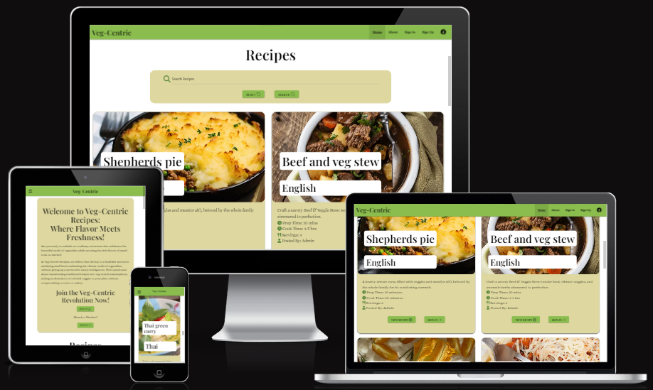
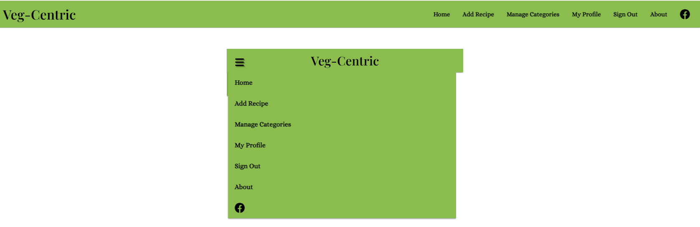
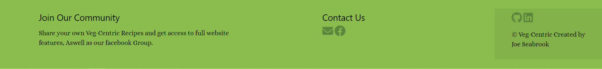
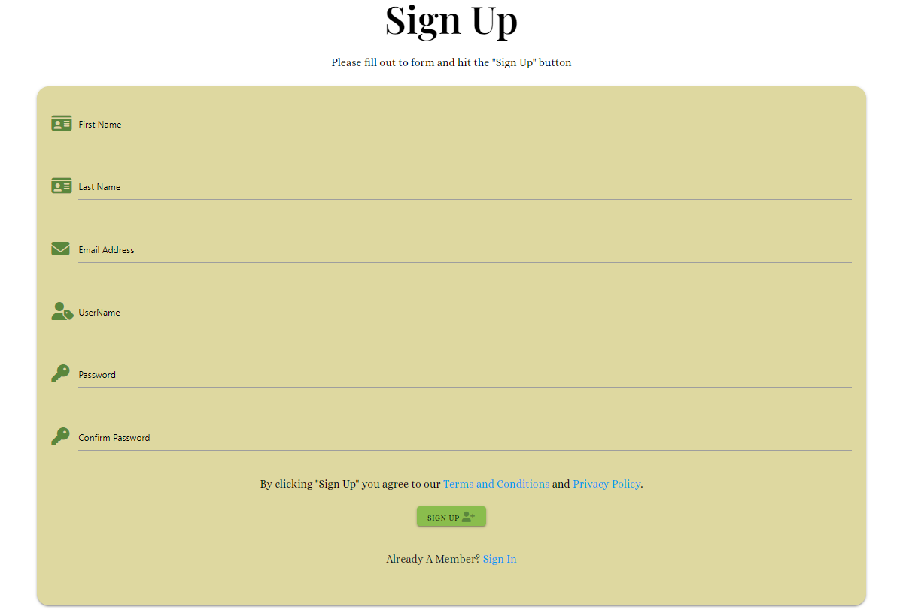
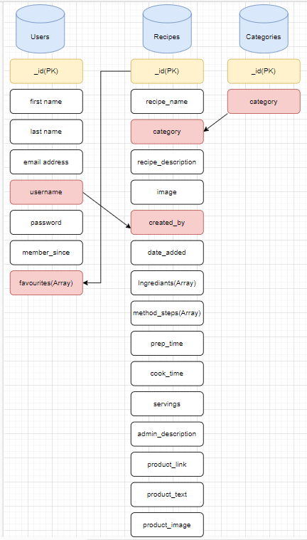

# Veg-Centric Recipes

# A responsive web application for Users to view and share Veg-Centric recipes.

## Code Intstitute - Milestone Project 3

## HTML / CSS / Jquery / Python / Jinja / Flask / MongoDB / Materialize / Cloudinary / Heroku

### By Joe Seabrook


Image from [UI.dev](https://ui.dev/amiresponsive)

### Repository Link

[View in GitHub Pages](https://github.com/Jaycode88/veg-centric-msp3)

### Live Project Link

[View Deployment Link](https://veg-centric-msp3-64721c5e710e.herokuapp.com/)

# Content

- ## The Why

Veg-Centric Recipes addresses a growing need for economical and sustainable dining options. As people seek ways to reduce food costs, we recognize that incorporating more vegetables into meals is not only healthier but also more budget-friendly than heavy meat-based dishes. We're here to show that delicious, wallet-friendly meals can be centered around vibrant veggies.

- ## Business Goal

- Expand our user base to build a thriving community.

- Gain revenue streams through advertising opportunities and affiliate marketing partnerships, enabling us to continue offering valuable resources and content to our users.

- ### User Stories

    - #### First-Time User Goals

        - Enjoy a User-Friendly Experience: A user-friendly interface and navigation system that allows users to easily explore the website and discover recipes and resources.

        - Browse Veg-Centric Recipes: Users will want to discover simple and time-efficient vegetable-based recipes for their meals.

        - Join the community: A User may want to join the community and share their own recipes

        - Find information about Veg-Centric.

    - #### Returning User Goals

        - Contribute to the Community: Enable returning users to actively contribute to the community by sharing their own veg-centric recipes.

        - Save Favorite Recipes: Allow users to save their favorite veg-centric recipes to their profile for easy access on return visits.

        - To be able to view, edit and Delete their uploaded recipes.

        - To have a page with user information with the option to update.

    - #### Website Owner Goals

        - Edit all Recipes to ensure content quality.

        - Edit recipe images for aesthetical purposes.

        - The ability to add Categories.

        - Generate revenue Through Affiliate Marketing.

## THE 5 PLANES
- ### Strategy

    - **Purpose of the website?**

        Provide a diverse and accessible collection of veg-centric recipes, cooking tips, and resources to inspire and assist users in their culinary journey.

    - **Target audience?**

        * Home Cooks and Food Enthusiasts: Those who enjoy cooking and are looking for creative, vegetable-centric recipes that offer both flavor and nutrition.

        * Health-Conscious Consumers: Individuals who prioritize their health and are seeking ways to incorporate more vegetables into their diets for improved well-being.

        * Budget-Conscious Shoppers: People who are mindful of their food expenses and are interested in cost-effective meal options that don't compromise on taste or nutrition.

    - **Value to the user?**

        * Economical Dining Solutions: We empower users to save money on their food expenses by sharing budget-friendly veg-centric recipes that prove that healthy eating doesn't have to break the bank.

        * Inspiration for Healthier Living: The platform inspires users to make healthier dietary choices by showcasing the nutritional benefits of vegetable-centric meals, helping them achieve their wellness goals.

        * Community and Connection: We foster a vibrant and supportive community where users can connect with like-minded individuals, share their culinary experiences, and exchange ideas for veg-centric living.

    - **What makes a good experience ?**

      * User-Friendly Interface: A well-designed and intuitive interface that is easy to navigate, ensuring that users can find and upload recipes.

      * Responsive Design: A website that adapts seamlessly to various devices and screen sizes, ensuring a consistent and enjoyable experience whether users are on desktop, tablet, or mobile.

      * Search Option: Robust search feature that allow users to find specific recipes by Name, Category and User.

      * Accessibility: Ensuring that the website is accessible to users with disabilities, including features like alt text for images and keyboard navigation.

      * Community Engagement: A vibrant and active community where users can share their own recipes with others who share their interests.

    - **What we shouldn't do?**

        * Spam or Over-Promotion: We do not engage in spammy practices, including excessive advertising, unsolicited emails, or intrusive pop-ups that disrupt the user experience.

        * Misleading Information: We do not provide misleading or inaccurate information, especially regarding health, nutrition, or the environmental impact of food choices.

        * Plagiarism: We do not plagiarize content from other sources. All content on our platform is original, properly attributed, and respects copyright laws.

        * Neglecting User Privacy: We do not compromise user privacy by sharing or selling personal information without consent. We adhere to strict privacy policies to protect user data.

## Design
- ### Theme and Color Scheme

    Green And Goldenrod:
    This pallete Consists of the colors Olive Green (#5A873C), Apple Green (#8ABD4D), Pale Goldenrod (#DED8A0) and White (#FFFFF).

- #### **Color by Color:**
    Below is the Physcology of each color and its relation to food.

- **Olive Green**

    - Earthy and Sophisticated: Olive green is often associated with earthiness and sophistication. It's reminiscent of olive trees and has a muted, subdued quality.

    - Stability and Endurance: This shade of green can convey a sense of stability and endurance, making it suitable for products or environments that want to project reliability.

    - Military and Utility: Due to its use in military uniforms and utilitarian equipment, olive green can also evoke feelings of strength, resilience, and preparedness.

- **Olive Green in relation to food**
    -   Olive green may be associated with earthy and savory flavors. It's often found in Mediterranean cuisine due to its connection with olives. It can also be used in packaging or decor to suggest a more mature or refined culinary experience.

- **Apple Green**

    - Vibrancy and Freshness: Apple green, or bright green, is associated with vibrancy, freshness, and youthfulness. It's often used to create a lively and energetic atmosphere.
    
    - Creativity and Innovation: This shade of green can stimulate creativity and innovation. It's often used in marketing to catch attention and convey a sense of excitement.

    - Positive and Playful: Apple green is a playful and positive color. It can evoke feelings of happiness and cheerfulness, making it suitable for products and designs aimed at children or those seeking a fun experience.

- **Apple Green in relation to food**
    - Health and Natural Foods: Like other shades of green, apple green is linked to health and natural foods. It can be used to suggest that a product is fresh, organic, and good for you.

    -  Bright green is frequently used in marketing fresh and vibrant foods, such as green apples, limes, and kiwis. It can make food appear more appealing, especially if the goal is to convey a sense of freshness and healthiness.

- **Research of green used by Food Companys and Authoritys**
    - Upon research into the use of the color green within in the food sector I found many large companies and Authorities Use this color in different shades in their logos and marketing, Including 2 recipe websites.


- **Pale Goldenrod**


     Whilst this colour is not normally considered in the normal mushroom range of colours I chose it due to it closeness to the mushroom range without the grey hue which can cause slight visibility problems with text, yet still holds the earthy undertones of mushroom. This color offers:

     - Warmth: #DED8A0 is a warm color with yellow undertones. Warm colors are often associated with feelings of comfort and positivity.

     - Cheerfulness: The goldenrod hue in #DED8A0 can evoke feelings of cheerfulness and optimism.

     - Earthiness: This color has earthy qualities, which can convey a sense of stability and groundedness.

     - Subtlety: It's a relatively muted color, suggesting a sense of understated elegance and calmness.

- **Pale Goldenrod in relation to food**
    - Natural and Wholesome: This color has earthy qualities, making it suitable for describing foods that are natural, organic, and wholesome. Think of fresh produce from a farmer's market.

    - Warm Desserts: In the realm of desserts, #DED8A0 might be likened to the golden-brown crust of a freshly baked pie or the warm, inviting color of a bread pudding. It conveys a sense of indulgence.

- **White**


    While white may not be a traditional color associated with specific emotions, it carries its own psychological connotations:
    - Simplicity and Minimalism: White is frequently associated with simplicity and minimalism. It represents clarity, order, and a sense of space. In design and aesthetics, it's used to create clean, uncluttered visuals.

    - Cleanliness and Hygiene: White is often used in healthcare settings and for sterile environments because it conveys a sense of cleanliness and hygiene. It's associated with sterility and a lack of contaminants.

    - Versatility: White is a neutral color that pairs well with other colors. It can act as a canvas to make other colors pop and stand out. Its versatility makes it a popular choice in various design contexts.

- **White in relation to food**

    - Clean and Fresh: In food presentation, white plates and table settings are often used to convey cleanliness and freshness. White makes food appear clean and appetizing.

    - Contrast: The contrast of white against vibrant food colors can make dishes visually striking. For example, a bright red tomato sauce on a white plate creates an appealing contrast.

    - Neutrality: White is a neutral background that allows the colors, textures, and shapes of food to stand out. It's a common choice for food presentation in fine dining.


 ### Design Brief:
- ## Typography
 #### Font Choices
In designing this project, I carefully selected fonts to convey the desired visual identity and user experience. My font choices which all came from [Google Fonts](https://fonts.google.com/), are as follows:

   - **Playfair Display (Logo and Headings)**

   

- *Psychology*: Playfair Display is a serif font known for its elegance and sophistication. It carries a sense of tradition and classicism, making it an excellent choice for logos and headings. The distinctive serifs and high contrast between thick and thin strokes create a sense of luxury and refinement, aligning with the project's premium and professional aesthetic.

- **Alice (Body Text)**


- *Psychology*: Alice is a modern and legible sans-serif font. It offers a clean and friendly appearance, making it an ideal choice for body text. The simplicity and readability of Alice ensure that users can comfortably consume content without distraction. This font choice promotes a user-friendly experience, enhancing readability and accessibility. 

 #### Fallback Font

 

 As a best practice, I have also included a fallback font in The design. In cases where browsers or devices may not support the specific fonts mentioned above, we use a generic sans-serif font. This ensures that the text remains legible and maintains a consistent appearance across various platforms.

Our font choices, including the fallback option, reflect the project's personality and goals, combining elegance with readability to create an engaging and visually appealing user interface.

- ## Background
    In This design, I have chosen a white background as the primary canvas for several compelling reasons:
    
    - Cleanliness and Freshness: White universally signifies cleanliness and freshness, aligning with our goal of presenting a clean and inviting interface. It provides a pristine, clutter-free backdrop that conveys purity and simplicity.

    - High Readability: White backgrounds ensure excellent text contrast, enhancing content readability. This is crucial for user engagement and comprehension in our user interface.

    - Timelessness: hite backgrounds have a timeless quality, remaining relevant and appealing over time. They serve as a neutral canvas that allows other design elements to shine.

    - Image Appeal: The decision to employ a plain white background serves a crucial purpose within the design. By opting for a minimalist backdrop, we intentionally create a canvas that allows the vibrant colors within the images to take center stage and captivate the user's attention.

Additionally, I've introduced pale goldenrod cards (#DED8A0) strategically in certain interface sections for visual interest and subtle elegance.

- ## Wireframes
    The basic layout of Veg-Centric Recipes was created with [Balsamiq](https://balsamiq.com/).

    - **Homepage**
    

    - **About**
    

    - **Sign Up**
    

    - **Sign In**
    

    - **Profile**
    

    - **Add Recipe**
    

- ## High Fidelity Prototype
    The Prototype for the main page was made with [Figma](https://www.figma.com/)

    - **Home Page**
    

    - **Recipe details Page**
    

- ## Features
 - #### Navigation Bar
    - The navigation bar is a central feature that enhances the user experience by providing easy access to key functionalities and content within Veg-Centric.  Whether on a desktop or a mobile device, users can seamlessly navigate through the application with the help of this feature.

    - The Nav Bar consist of: The Brand Logo which when clicked directs the user to the homepage, Top bar Navigation for larger screens and Dropdown Nav for Mobile decvices.

    -  Depending on the user's role and session status, the Nav Bar & Dropdown provide a set of relevant links for easy navigation



 - #### Footer Bar
    - The footer bar is a key component of Veg-Centric, designed to enhance user engagement, transparency, and accessibility. It appears at the bottom of every page and contains valuable information and links to various resources.

    - The Join our community section:  This is a a strategically placed text to entice users to join the community

    - The contact us section: This section offers the user the option to get in contact via either email or facebook with icons for links.

    - The Developer information section: Here you can find important information behind Veg-Centric, Including icon links to the GitHub Repo and the developers LinkedIn Page.



- #### Recipe Search
    - The search feature enhances the user experience by providing a tailored way to find recipes that match their preferences. Users can quickly filter through a large collection of recipes and discover the ones that align with their culinary interests.

    - The search form was created with [Materialize](https://materializecss.com/)


- #### Recipe Cards
    - Recipe cards are the visual representation of individual recipes within our web application. Each recipe card provides a comprehensive overview of a specific recipe, allowing users to quickly assess its details, category, and more.

    - The recipe cards are designed to offer a visually pleasing and user-friendly experience. They provide a quick and convenient way for users to browse through our recipe collection, find dishes of interest, and take actions based on their preferences.


- #### Recipe Details page
    - The Recipe Details Page offers users a rich and informative experience, enabling them to explore recipes in detail

    - It encourages user interaction by offering the option of adding to favorites.

    - If Admin has edited a recipe to add affiliate products the Recipe Details page Transforms to include the product intro, Image and affiliate link


- #### Add and Edit Recipe Forms
    - The Add and Edit Recipe forms are a fundamental feature of our veg-centric recipe sharing site, allowing users to contribute their own delicious Veg-Centric recipes to our growing community. 
    
    - The Edit recipe form Is pre-populated with the recipe data for the user to change.


- #### Sign In and Sign Up
    - I added a Sign up Feature so users can join the community and upload their own recipes and save other user's recipes to their favorites.

    - The User is notified that by signing up they agree to the terms and conditions and privacy policy which can be viewed via the linked text which opens a modal to display the information.

    - Users that are signed Up and Signed in are able to save favourite recipes aswell as edit and delete their own recipes.




- #### Profile Page
    - The Profile Page enhances the user experience by centralizing user-related information and actions. It allows users to manage their profile, access their uploaded recipes, and easily revisit their favorite recipes. Additionally, it provides a sense of ownership and engagement within the Veg-Centric community.


- #### About Page
    - The About page in the project provides users with a comprehensive overview of Veg-Centric Recipes. It introduces the project's mission, highlights the significance of a veg-centric lifestyle, and delves into the vibrant community that makes this project unique. Additionally, links are provided to our Terms and Conditions and Privacy Policy for users to reference. This page aims to give users a clear understanding of what Veg-Centric Recipes is all about and how they can get involved.


- #### Facebook Page
  The design seamlessly integrates with the official Facebook page, enhancing user engagement and keeping users connected:

    - Community Connection: Join our culinary community for updates, discussions, and like-minded connections.

    - Real-Time Updates: Stay in the loop with the latest platform news, events, and culinary trends.

    - User Engagement: Engage with our community through interactive posts and discussions.


- #### Admin Features
The Admin Has extra options over Standard users many of these are to maintain readability standards such as editing spelling mistakes etc.

 - **Manage Catagories page**
    On this page the Admin can add, edit and remove categories.
    

- **Edit Recipe**
    The Admin's Edit recipe form includes more inputs, Allowing the site owner to edit users recipes for the purpose of removing spelling mistkes, changing the image for aesthetical purposes, Adding product information and links to affiliates.

    

    Admin also have extra buttons on the recipes details page allowing them to edit and delete all user recipes.

    

 - ## Future Features I would like to include
    - #### User ratings
    
        I think it would be a nice touch for users to be able to rate recipes they have tried, With these ratings displaying among the recipe details.

    - #### Social Media Share
        
        I would like to add option for users to be able to share recipes to their social media pages.

    - #### Product Database
        I would like to add another database for suggested products so they do not have to be typed out seperately by admin for each recipe. I have held off of doing this so far as it has a down side that the product suggestions text is not personalised to the recipe, as it is currrently.

    - #### Blog  
        I think a Blog would make an excellent addition to this project, It could consist of posts containing a variety of information from topics such as: Shopping on a budget, Economical cooking ideas, Seasonal produce.

    - #### User Engagement
        Once the Application has a small comunity of people posting recipes, It would be good marketing practice to highlight things like Best user posted recipe of the week etc to the facebook group and blog. This would encourage user engagement. Could possibly have small competitions.

        If I were to make a blog for the Application I would like to offer users the oppurtunity to send in their own Veg-Centric blog articles which could be featured on the blog and facebook group.

    - #### Admin Control 
        It would be nice for admin to have a users control area, A base where admin can see user information such as recipes posted, date joined etc. This could also be a great way to track users that are posting spam or offensive content, It could include a send warning email to user function aswell as have the option to block the user from using the app.

- ## **DATABASES**
    In this application, I rely on [MongoDB](https://mongodb.com/) as the primary database management system. MongoDB is a flexible NoSQL database that allows us to store and manage data in a format that seamlessly fits the dynamic nature of our project. It plays a crucial role in storing user information, recipes, categories, and other essential data.

    The database schema is designed to efficiently handle the storage and retrieval of data, ensuring that users can seamlessly interact with the application. This section provides an insight into how the application leverages MongoDB to perform various operations, including user management, recipe management, and more.

- **Models Flow Chart**

    The arrows on the chart show the connections made between databases in my code.

    

### **CRUD Functionality**
##### User Management:
1. **Create User (C):**
    - Function: 'sign_up'
   - Description: Allows users to register by providing necessary information. Includes checks for:
     - Matching passwords
     - Existing username
     - Existing email

    - HTTP Method: POST

    - Database Operation: Inserts new user document into the "users" collection.

2. **Read User (R):**
    - Function: 'autheticate_user'

    - Description: Authenticates a user based on their username and password.

    - HTTP Method: N/A(Called within the sign_in route)

    - Database Operation: Reads user information to verify credentials.

3. **Update User (U):**
    - Function: 'edit_profile'

    - Description: Allows users to update their profile information, including name and email.

    - HTTP Method: POST

    - Database Operation: Updates the user's document in the "users" collection.

4. **Delete User (D):**
    - Function: 'delete_profile'

    - Description: Allows users to delete their profiles.

    - HTTP Method: POST

    - Database Operation: Deletes the user's document from the "users" collection.

##### Recipe Management:
1. **Create Recipe (C):**
    - Function: 'add_recipe'

    - Description: Allows users to add new recipes, including recipe details and ingredients.

    - HTTP Method: POST

    - Database Operation: Inserts a new recipe document into the "recipes" collection.

2. **Read Recipe (R):**
    - Function: 'view_recipe'

    - Description: Displays the details of a specific recipe.

    - HTTP Method: GET

    - Database Operation: Retrieves the recipe details from the "recipes" collection.

3. **Update Recipe (U):**
    - Function: 'edit_recipe'

    - Description: Allows users (or admins) to edit existing recipes, including image and details. Includes checks for:
        - Ownership of the recipe

    - HTTP Method: POST

    - Database Operation: Updates the recipe document in the "recipes" collection.

4. **Delete Recipe (D):**
    - Function: 'delete_recipe'

    - Description: Allows users (or admins) to delete recipes. Includes checks for:
    Ownership of the recipe

    - HTTP Method: POST

    - Database Operation: Deletes the recipe document from the "recipes" collection.

##### Favorite Recipes:
1. **Create Favorite Recipe (C):**
    - Function: 'add_to_favorites'

    - Description: Allows users to add a recipe to their list of favorite recipes.

    - HTTP Method: POST

    - Database Operation: Updates the user's document to add the recipe ID to their "favorites" list.

2. **Delete Favorite Recipe (D):**
     - Function: 'remove_favorite'

    - Description: Allows users to remove a recipe from their list of favorite recipes.

    - HTTP Method: POST

    - Database Operation: Updates the user's document to remove the recipe ID from their "favorites" list.

##### Category Management (Admin Only):
1. **Create Category (C):**
    - Function: 'add_category'

    - Description: Allows admins to add new recipe categories.

    - HTTP Method: POST

    - Database Operation: Inserts a new category document into the "categories" collection.

2. **Read Category**
    - Function: N/A

    - Description: Categories are read directly from the "categories" collection for displaying recipe categories.

3. **Update Category (U):**
    - Function: 'edit_category'

    - Description: Allows admins to edit existing recipe categories.

    - HTTP Method: POST

    - Database Operation: Updates the category document in the "categories" collection.

4. **Delete Category (D):**
    - Function: 'delete_category'

    - Description: Allows admins to delete recipe categories.

    - HTTP Method: GET

    - Database Operation: Deletes the category document from the "categories" collection.

##### Other Functionality:
1. **Search Recipes (R):**
    - Function: 'search_recipes'

    - Description: Allows users to search for recipes based on a search query.

    - HTTP Method: POST

    - Database Operation: Queries the "recipes" collection for matching recipes.

2. **Sign In (R):**
    - Function: 'sign_in'

    - Description: Allows users to sign in by providing their credentials. Includes checks for:
        - Incorrect username or password

    - HTTP Method: GET and POST

    - Database Operation: Calls authenticate_user to validate user credentials.

3. **Sign Out:**
    - Function: 'sign_out'

    - Description: Allows users to sign out of their accounts.

    - HTTP Method: GET

    - Database Operation: N/A 

The sign out function works by removing the users session cookie.

4. **404 Error Handling (R):**
    - Function: 'page_not_found'

    - Description: Handles 404 errors by rendering a custom error page.

    - HTTP Method: N/A

    - Database Operation: N/A

## **TESTING**

For the documentation of all testing,Please see [TESTING.md](TESTING.md) 

## **DEPLOYMENT**
- ### Local Deployment
This project can be cloned or forked in order to make a local copy on your own system.

- #### Cloning
    You can clone this repository by following these steps:

    1. Go to the [GitHub repository](https://github.com/Jaycode88/veg-centric-msp3) 
    2. Locate the Code button above the list of files and click it 
    3. Select if you prefer to clone using HTTPS, SSH, or GitHub CLI and click the copy button to copy the URL to your clipboard
    4. Open Git Bash or Terminal
    5. Change the current working directory to the one where you want the cloned directory
    6. In your IDE Terminal, type the following command to clone my repository:
        - `git clone https://github.com/Jaycode88/veg-centric-msp3.git`
    7. Press Enter to create your local clone.

    Alternatively, if using Gitpod, you can click below to create your own workspace using this repository.

[](https://gitpod.io/#https://github.com/Jaycode88/veg-centric-msp3)

Please note that in order to directly open the project in Gitpod, you need to have the browser extension installed.
A tutorial on how to do that can be found [here](https://www.gitpod.io/docs/configure/user-settings/browser-extension)

- #### Forking
    By forking the GitHub Repository, we make a copy of the original repository on our GitHub account to view and/or make changes without affecting the original owner's repository.
    You can fork this repository by using the following steps:

    1. Log in to GitHub and locate the [GitHub Repository](https://github.com/Jaycode88/veg-centric-msp3)
    2. At the top of the Repository (not top of page) just above the "Settings" Button on the menu, locate the "Fork" Button.
    3. Once clicked, you should now have a copy of the original repository in your own GitHub account!

 - **Running Locally**

    After you have cloned or forked the repository and navigated to the project directory, you can set up your local environment as follows:

    1. **Install Dependencies**: Make sure you have Python 3.x installed on your system. Then, install the required dependencies listed in the `requirements.txt` file:

        ```  
        pip install -r requirements.txt
        ``` 

    2. **Configure Environment Variables**: If your application requires environment variables, create a `.env` file in the project directory and add the necessary variables.

    3. **.gitignore File**: Ensure that you have a `.gitignore` file in your project to exclude sensitive information and files from being committed to version control. Common entries in a `.gitignore` file include `.env`, `.pyc` files, and other temporary or generated files.

    4. **Run the Application**: Start the local development server using the following command:

        ```
        python3 app.py
        ```

        Replace `app.py` with the actual name of your main application file.

- ### Deployment with Heroku
    This application can be deployed on Heroku to make it accessible on the web. Follow these steps to deploy your app:

    - #### Prerequisites

        Before deploying the app on Heroku, make sure you have the following prerequisites:

        1. [Heroku Account](https://signup.heroku.com/) - You need a Heroku account to deploy your app.
        2. [Heroku CLI](https://devcenter.heroku.com/articles/heroku-cli) - Install the Heroku Command Line Interface to interact with Heroku from your terminal.

    - ### Deployment Steps

    1. **Login to Heroku**: Open your terminal and log in to your Heroku account using the following command:
   
        ```
        heroku login
        ```
        Follow the prompts to log in to your Heroku account.

    2. **Create a Heroku App**: Navigate to your project directory in the terminal and create a new Heroku app
        ```
        heroku create your-app-name
        ```
        Replace your-app-name with a unique name for your app. Heroku will provide you with a URL for your app (e.g., https://your-app-name.herokuapp.com/).

    3. **Configure Environment Variables**: Store sensitive information like secret keys and API credentials as environment variables on Heroku. You can set these variables using the Heroku CLI or through the Heroku Dashboard
        ```
        heroku config:set SECRET_KEY=your-secret-key
        heroku config:set API_KEY=your-api-key
        ```
        Replace your-secret-key and your-api-key with the actual values you need to configure.

    4. **Deploy to Heroku**: Deploy your app to Heroku by pushing your code to the Heroku remote repository
        ```
        git push heroku main
        ```
        Ensure that you have committed all your changes to the main branch before running this command.

    5. **Open the App**: Once the deployment is complete, you can open your app in your web browser using the following command.
        ```
        heroku open
        ```
        This will open your app in a new browser window.

    #### Congratulations
    Your app is now deployed and live on Heroku with sensitive information securely managed as environment variables. You can share the Heroku app URL with others to access your application online.

- #### Local vs Deployment

    When working with this project, it's important to understand the differences between running the application locally and deploying it to Heroku:

    - **Local Development**: Running the application locally is ideal for development and testing purposes. You can make changes, test new features, and experiment with the code in a controlled environment.

    - **Heroku Deployment**: Deploying the application to Heroku makes it accessible to a wider audience on the web. It's suitable for sharing your project with others and providing a public URL for access.

    Choose the deployment option that best suits your needs and project goals.

    Always follow the steps and ensure that your sensitive information(API Keys, Database credentials, etc) are not visible to the public.

- ### Connecting to Cloudinary for User-Uploaded Images

    This application uses Cloudinary to store user-uploaded images. To configure your own Cloudinary integration, follow these steps:

    1. **Create a Cloudinary Account**: If you don't already have a Cloudinary account, sign up for one [here](https://cloudinary.com/).

    2. **Obtain API Credentials**: After creating your Cloudinary account, obtain your API key, API secret, and cloud name from your Cloudinary dashboard.

    3. **Configure Environment Variables**: Store your Cloudinary API credentials as environment variables in your local `.env` file or on your hosting platform. Here's an example of what your `.env` file might look like:

        ```env
        CLOUDINARY_API_KEY=your-api-key
        CLOUDINARY_API_SECRET=your-api-secret
        CLOUDINARY_CLOUD_NAME=your-cloud-name
        ```

        Replace `your-api-key`, `your-api-secret`, and `your-cloud-name` with your actual Cloudinary credentials.

    4. **Integrate Cloudinary in Your Application**: Modify your application code to use these environment variables to connect to Cloudinary for image uploads and management. Refer to your application's documentation for specific integration details.

    Now, your application should be configured to use Cloudinary for storing user-uploaded images.

- ### Connecting to MongoDB Database

    This application uses MongoDB as its database. To set up your own MongoDB database and configure it for your application, follow these steps:

    1. **Create a MongoDB Account**: If you don't already have a MongoDB account, sign up for one [here](https://www.mongodb.com/cloud/atlas).

    2. **Set Up a Database Cluster**: Create a new database cluster in your MongoDB Atlas dashboard. Follow the MongoDB documentation or your application's documentation for guidance on cluster creation.

    3. **Obtain Connection Credentials**: After setting up your cluster, obtain the connection string, including the username and password, from your MongoDB Atlas dashboard.

    4. **Configure Environment Variables**: Store your MongoDB connection string as an environment variable in your local `.env` file or on your hosting platform. Here's an example of what your `.env` file might look like:

        ```
        MONGODB_URI=your-connection-string
        ```

        Replace `your-connection-string` with your actual MongoDB connection string.

    5. **Integrate MongoDB in Your Application**: Modify your application code to use the environment variable to connect to your MongoDB database. Refer to your application's documentation for specific integration details.

    Now, your application should be configured to use MongoDB as its database.

## Credits

- ### Content
 - All worded content was originally creating by myself and then edited and improved with suggestions from [Chat GPT](https://chat.openai.com/).

- ### Media
    - All Icons Used were from [Font Awesome](https://fontawesome.com/) 

- ### Tools & Technologies Used
    - [HTML](https://en.wikipedia.org/wiki/HTML)  is the backbone of web content. It defines the structure and content of the web pages.
    - [CSS](https://en.wikipedia.org/wiki/CSS) used to control the visual presentation of the web application. It defines the layout, colors, fonts etc.
    - [JavaScript](https://www.javascript.com) is a client-side scripting language that enhances user interactivity on the web pages.
    - [Python](https://www.python.org/) is a versatile programming language commonly used for server-side development. It powers the logic and data processing of the web application.
    - [Jinja](https://jinja.palletsprojects.com/en/3.1.x/) Is a Python-based templating engine used to dynamically generate HTML content by inserting data into predefined templates.
    - [Cloudinary](https://cloudinary.com/) is a cloud-based service for uploading, storing, optimizing, and delivering media assets such as images and videos.
    - [MongoDB](https://mongodb.com/) is a document-oriented NoSQL database used for storing and managing structured data.
    - [Git](https://git-scm.com) used for version control. (`git add`, `git commit`, `git push`)
    - [GitHub](https://github.com) used for secure online code storage.
    - [Heroku](https://heroku.com) To create and Host the Deployed App.
    - [Gitpod](https://gitpod.io) used as a cloud-based IDE for development.
    - [Canva](https://www.canva.com/) used for meta icon and logo creation.
    - [Balsamiq](https://balsamiq.com/) used to create Wireframes.
    - [Figma](https://www.figma.com/) used for wireframes and high fidelity prototypes.
    - [Adobe colour wheel](https://color.adobe.com/) used for selecting colour scheme.
    - [Chat GPT](https://chat.openai.com/) Used for trouble shooting.
    - [Font Awesome](https://fontawesome.com/)
    - [Medium]( https://medium.com/@ashley_howell/understanding-colour-psychology-for-restaurants-brands-dbb7ffbcecae) Used to research colour physcology in relation to restaurant and food brands.
    - [JennDavid](https://jenndavid.com/colors-that-influence-food-sales-infographic/) Used to research colours that influence food sales. 

- ### Acknowledgements
    - I would like to thank my Code Institute mentor, [Alex K](https://calendly.com/alex_mentor) for his amazing help, advice and support throughout the development of this project.
    - I would like to thank Tim Nelson for his ongoing support.
    - I would like to thank the [Code Institute](https://codeinstitute.net) tutor team for their assistance with troubleshooting and debugging some project issues.
    - I would like to thank the [Code Institute Slack community](https://code-institute-room.slack.com) for the great advice.
    - I would like to thank freinds for there on going support and reviewing of the Web App.
