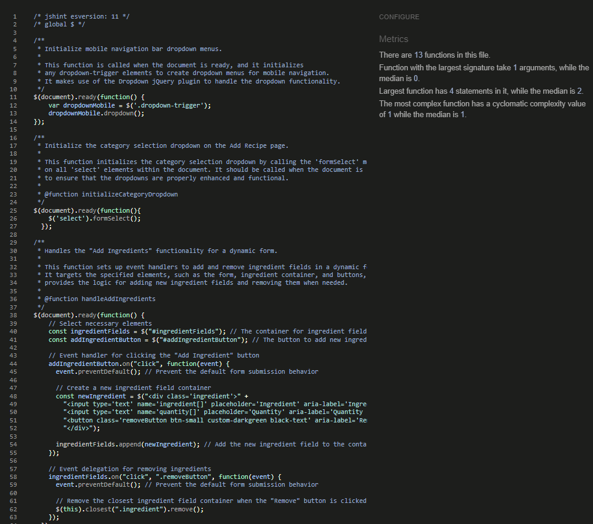

# Testing

Return back to the [README.md](README.md) file.

I have used various tools to Test Funcionality, Validity and responsiveness. I have been sure to check all layouts, colours, text, forms, links, buttons are functioning on all devices and screen sizes that I have tested.

## Code Validation

### HTML

I have used the recommended [HTML W3C Validator](https://validator.w3.org) to validate all of my HTML files. I checked validated by both URI and Copying and pasting the rendered page's source code into the checker.

- Results: 
  - [Home](https://validator.w3.org/nu/?doc=https%3A%2F%2Fveg-centric-msp3-64721c5e710e.herokuapp.com%2F)
  
    

  - [Add Recipe](https://validator.w3.org/nu/?doc=https%3A%2F%2Fveg-centric-msp3-64721c5e710e.herokuapp.com%2Fadd_recipe)
  
    

  - [Profile](https://validator.w3.org/nu/?doc=https%3A%2F%2Fveg-centric-msp3-64721c5e710e.herokuapp.com%2Fprofile%3Fusername%3Dtestuser)
  
    

  - [Sign In](https://validator.w3.org/nu/?doc=https%3A%2F%2Fveg-centric-msp3-64721c5e710e.herokuapp.com%2Fsign_in)
  
    

  - [Sign Up](https://validator.w3.org/nu/?doc=https%3A%2F%2Fveg-centric-msp3-64721c5e710e.herokuapp.com%2Fsign_up)
  
    

  - [About](https://validator.w3.org/nu/?doc=https%3A%2F%2Fveg-centric-msp3-64721c5e710e.herokuapp.com%2Fabout)
  
    

  - [Edit Recipe](https://validator.w3.org/nu/?doc=https%3A%2F%2Fveg-centric-msp3-64721c5e710e.herokuapp.com%2Fedit_recipe%2F6527b0b957b0bcdad6782f15)
  
    

  - [Edit Profile](https://validator.w3.org/nu/?doc=https%3A%2F%2Fveg-centric-msp3-64721c5e710e.herokuapp.com%2Fedit_profile)
  
    

  - Delete Profile (Via Source code Input)
  
    

  - [Recipe Details](https://validator.w3.org/nu/?doc=https%3A%2F%2Fveg-centric-msp3-64721c5e710e.herokuapp.com%2Frecipe%2F65004285e4bb3a34c6930886)

    

  - [Manage Categories(admin only page)](https://validator.w3.org/nu/?doc=https%3A%2F%2Fveg-centric-msp3-64721c5e710e.herokuapp.com%2Fmanage_categories)
  
    

  - 404 Error Page (Via Source code Input)
  
    

### CSS

I have used the recommended [CSS Jigsaw Validator](https://jigsaw.w3.org/css-validator) to validate all of my CSS files. when testing by Direct input The only warning recieved was due to external stylesheets not being able to be reached and when tested  by URI there is 1 Error and many warnings all related to the external stylesheets. All CSS Written by myself Passed Validation.

- link to results: [click here](https://jigsaw.w3.org/css-validator/validator?uri=https%3A%2F%2Fveg-centric-msp3-64721c5e710e.herokuapp.com%2F&profile=css3svg&usermedium=all&warning=1&vextwarning=&lang=en)


### JavaScript

I have used the recommended [JShint Validator](https://jshint.com) to validate my JS file. I used version 11 which does not throw errors due to use of ES6 syntax, Aswell as informing JSHint that I was intenionally using jQuery and the $ symbol. To set up JSHint in the same manner use the following notes at the top of your test:
```
/* jshint esversion: 11 */
/* global $ */
```

**Results**


### PEP8

I have used [Python Linter](https://pep8ci.herokuapp.com/) (Provided by CodeInstitute) to check all Python files are PEP8 compliant.
  - App.py
  

  - settings.py
  

## User Story Testing

| AIM | Achieved | Image|
|-----|----------|------|
**As a first time user to the website, I would like to...**
| Enjoy a user freindly experience | Yes | |
| Browse Veg-Centric Recipes | Yes |   |
| Join The Community | Yes |  |
| Find information about Veg-Centric | Yes |  |
**As a Returning user, I would like to...**
| Contribute to the community | Yes |  |
| Save Recipes As Favorites and view favorites | Yes |  |
| View, Edit and Delete their own recipes | Yes |   |
| To have a page with user information | Yes |  |
**As Website Owner I would like to...**
| Edit all recipes to ensure content quality | Yes |   |
| Edit recipe images for aesthitical purposes | Yes |   |
| Add categories | Yes |  |
| Generate profit through affiliate marketing | Yes |  |

## Browser Compatability / Cross Platform Testing

### CRUD (create, read, update, delete) Testing

| Aim | Admin | User | Non User |
|-----|-------|------|----------|
**Profile**
| CREATE a Profile | Yes | Yes | Yes |
| READ Profile Details | Yes | Yes | No(As Intended) |
| UPDATE Profile Details | Yes | Yes | No(As Intended) |
| DELETE Profile | Yes | Yes | Yes | No(As Intended) |
**Recipe**
| CREATE a Recipe | Yes | Yes | No(As Intended) |
| READ a Recipe | Yes | Yes | Yes |
| UPDATE a Recipe | Yes | Yes | No(As Intended) |
| DELETE a Recipe | Yes | Yes | No(As Intended) |
**Recipe Product Suggestions**
| CREATE a Suggestion | Yes | No(As Intended) | No(As Intended) |
| READ a Suggestion | Yes | Yes | Yes |
| UPDATE a Suggestion | Yes | No(As Intended) | No(As Intended) |
| DELETE a Suggestion | Yes | No(As Intended) | No(As Intended) |
**Favorites**
| CREATE a Favorite | Yes | Yes | No(As Intended) |
| READ a Favorite | Yes | Yes | No(As Intended) |
| UPDATE a Favorite | No(As Intended) | No(As Intended) | No(As Intended) |
| DELETE a Favorite | Yes | Yes | No(As Intended) |

### Form Validation Testing

| Aim | SM | MD | LG |
|-----|----|----|----|
**Sign Up**
| First Name field must only contain letters from 2 to 20 characters and is required | Yes | Yes | Yes |
| Last Name field must only contain letters from 2 to 20 characters and is required | Yes | Yes | Yes |
| Email field must contain @ in valid format, Between 8 - 50 characters and is required | Yes | Yes | Yes |
| Username field accepts only alphanumeric and limited special characters, must be between 5 - 20 characters and is required | Yes | Yes | Yes|
| Password field accepts only alphanumeric and limited special characters, must hide characters, Be between 6 - 15 charachters and is required | Yes | Yes | Yes |
| Confirm Password field accepts only alphanumeric and limited special characters, must match password field and hide characters, Be between 6 - 15 charachters and is required | Yes | Yes | Yes |
| Shows Terms and Privacy Policy read options | Yes | Yes | Yes |
| Form Submits upon use of button | Yes | Yes | Yes |
| Form Resets upon use of button | Yes | Yes | Yes |
| Sign Up button is visible and functioning | Yes | Yes | Yes || Sign Up button is visible and functioning | Yes | Yes | Yes |
**Sign In**
| Username Must match with user in the database | Yes | Yes | Yes |
| Password field Must match with the password in the database for the username given | Yes | Yes | Yes |
| Form Submits upon use of Sign In button | Yes | Yes | Yes |
| Sign Up Button is visible and functional | Yes | Yes | Yes |
**Edit Profile**
| First Name field must only contain letters from 2 to 20 characters and is required | Yes | Yes | Yes |
| Last Name field must only contain letters from 2 to 20 characters and is required | Yes | Yes | Yes |
| Email field must contain @ in valid format, Between 8 - 50 characters and is required | Yes | Yes | Yes |
| New Password field accepts only alphanumeric and limited special characters, must hide characters, Be between 6 - 15 charachters and is required | Yes | Yes | Yes |
| Confirm New Password field accepts only alphanumeric and limited special characters, must match New password field and hide characters, Be between 6 - 15 charachters and is required | Yes | Yes | Yes |
| Form Submits upon use of save button | Yes | Yes | Yes |
| Option to delete profile is shown | Yes | Yes | Yes |
**Add A Recipe**
| Recipe name field must contain only alphanumeric characters, Be between 3 -30 characters and is required | Yes | Yes | Yes |
| Recipe Category field Must display Dropdown of categories from database, Only dropdown Items can be selected(no manual input) and is required | Yes | Yes | Yes |
| Recipe description field must only contain alphanumeric characters with a a length between 15 - 120 charachters and is required | Yes | Yes | Yes |
| Prep Time field must only contain alphanumeric characters, Be between 4 - 20 characters and is required | Yes | Yes | Yes |
| Cook Time field must only contain alphanumeric characters, Be between 4 - 20 characters and is required | Yes | Yes | Yes |
| Servings field must only contain numeral characters and is required | Yes | Yes | Yes |
| Upload image field Allows image file only to be uploaded and is required | Yes | Yes | Yes |
| Add Ingredient and Add Step Buttons are visible and functional | Yes | Yes | Yes |
| Add ingredients field must contain alphanumeric characters, Remove ingredient field button is visible and functional | Yes | Yes | Yes |
| Add method step field must contain alphanumeric characters, Remove step field button is visible and functional | Yes | Yes | Yes |
| Form Submits upon use of Post button | Yes | Yes | Yes |
| Form Resets upon use of Reset button | Yes | Yes | Yes |
**Edit a Recipe for user**
| Recipe name field must contain only alphanumeric characters, Be between 3 -30 characters, is required and prefilled| Yes | Yes | Yes |
| Recipe Category field Must display Dropdown of categories from database, Only dropdown Items can be selected(no manual input), is required and prefilled | Yes | Yes | Yes |
| Recipe description field must only contain alphanumeric characters with a a length between 15 - 120 charachters and is required | Yes | Yes | Yes |
| Prep Time field must only contain alphanumeric characters, Be between 4 - 20 characters, is required and prefilled | Yes | Yes | Yes |
| Cook Time field must only contain alphanumeric characters, Be between 4 - 20 characters, is required and prefilled | Yes | Yes | Yes |
| Servings field must only contain numeral characters, is required and prefilled | Yes | Yes | Yes |
| Upload image field Allows image file only to be uploaded, is required and prefilled | Yes | Yes | Yes |
| Add Ingredient and Add Step Buttons are visible and functional | Yes | Yes | Yes |
| Previously added ingredients and methods are shown | Yes | Yes | Yes |
| Add ingredients field must contain alphanumeric characters, Remove ingredient field button is visible and functional | Yes | Yes | Yes |
| Add method step field must contain alphanumeric characters, Remove step field button is visible and functional | Yes | Yes | Yes |
| Form Submits upon use of Update button | Yes | Yes | Yes |
| Delete Recipe button is visible and functional | Yes | Yes | Yes |
**Edit a Recipe for Admin**
| Recipe name field must contain only alphanumeric characters, Be between 3 -30 characters, is required and prefilled | Yes | Yes | Yes |
| Recipe Category field Must display Dropdown of categories from database, Only dropdown Items can be selected(no manual input), is required and prefilled | Yes | Yes | Yes |
| Recipe description field must only contain alphanumeric characters with a a length between 15 - 120 charachters, is required and prefilled | Yes | Yes | Yes |
| Prep Time field must only contain alphanumeric characters, Be between 4 - 20 characters, is required and prefilled | Yes | Yes | Yes |
| Cook Time field must only contain alphanumeric characters, Be between 4 - 20 characters, is required and prefilled | Yes | Yes | Yes |
| Servings field must only contain numeral characters, is required and prefilled | Yes | Yes | Yes |
| Upload image field Allows image file only to be uploaded, is required and prefilled | Yes | Yes | Yes |
| Add Ingredient and Add Step Buttons are visible and functional | Yes | Yes | Yes |
| Previously added ingredients and methods are shown | Yes | Yes | Yes |
| Add ingredients field must contain alphanumeric characters, Remove ingredient field button is visible and functional | Yes | Yes | Yes |
| Add method step field must contain alphanumeric characters, Remove step field button is visible and functional | Yes | Yes | Yes |
| Admin Description field must be between 15-5000 characters and is not required | Yes | Yes | Yes |
| Product text field must contain alphanumeric characters and be between 15 - 500 characters and is not required | Yes | Yes | Yes |
| Product image field accepts alphanumeric characthers for image urls, between 15 - 500 charachters long and is not required | Yes | Yes | Yes |
| Product link field accepts alphanumeric characthers between 15 - 500 charachters long and is not required | Yes | Yes | Yes |
| Form Submits upon use of Update button | Yes | Yes | Yes |
| Delete Recipe button is visible and functional | Yes | Yes | Yes |
**Manage Categories for Admin**
| Add category field accepts alphanumeric characters and is required | Yes | Yes | Yes|
| Edit Category field accepts alphanumeric characters , is required and prefilled | Yes | Yes | Yes |
| Update and Delete Category buttons are visible and functional | Yes | Yes | Yes |

### LightHouse Testing
I used Google Chrome Lighthouse testing to assess the quality of the web app.

N.B Table or Images of Results

## Responsiveness
I've tested my deployed project on multiple devices to check for responsiveness issues.

N.B note here the minimum screen size and research on devices. add image of researched table.

N.B Add responsiveness table as in previous project

## Automated Testing
### Jest Testing JQuery

I first attempted to test my JQuery code with jest version 29.7.0, I first installed the nessacery packages using the commands bellow:

To install Jest:
```
npm install --save-dev jest
```

To install jsdom:
```
npm install --save-dev jest-environment-jsdom
```

To install jQuery as a development dependancy:
```
npm install --save-dev jquery
```

I then created the jest.config.js file in the root directory as well as a new ```__tests__```folder containing my jquery-mock.js(to mock jquery globally. instead of writing it into each test) and my script.test.js(containing my tests). I kept recieving the this error:
```
ReferenceError: $ is not defined
```
Despite having installed jquery as a dependancy I could not find a way for Jest to test my jQuery code. 

### Jest Testing JavaScript
I decided to re-write all jQuery functions into Javascript functions in a seperate  file called javascript.js(in a tests directory within the "JS" directory where my script.js file is located). I found I also needed to install Babel and some related packages using:
```
npm install --save-dev @babel/core @babel/preset-env babel-jest
```
I also had to create a "babel.config.js file in my root directory its contents as follows:
```
module.exports = {
  presets: [
    [
      '@babel/preset-env',
      {
        targets: {
          node: 'current',
        },
      },
    ],
  ],
};
```
This also required me to Update my jest configuration file to match below:
```
module.exports = {
  testEnvironment: 'jsdom',
  transform: {
    '^.+\\.js$': 'babel-jest',
  },
};
```
From there I was able to write tests for the initializeDropdown, initializeCollapsible, handleAddIngridient, handleAddMethodStep and initializeFormSelect Functions which all passed:


Below is a description of the one function I attempted to test with no success.

- **initializeModals Function**
    1. **Setup**: I set up a testing environment using Jest and included the tests for the `initializeModals` function within the same file as the other tests.

    2. **Mocking Dependencies**: I successfully mocked the dependencies required by the `initializeModals` function, such as `M.Modal.init` and the event listeners for the Terms and Privacy links.

    3. **Testing Initialization**: I initially attempted to test whether the `initializeModals` function correctly initializes the modals by checking if `M.Modal.init` is called for each modal element with the '.modal' class. This part of the test passed without issues.

    4. **Simulating Click Events**: To test the modal control functionality, I tried to simulate click events on the Terms and Privacy links ('#termsLink' and '#privacyLink') to ensure that the respective modals are opened.

    5. **Challenges and Issues**:

    - **Failure to Open Modals**: Despite my efforts, I encountered persistent issues with simulating the click events on the links. Specifically, I faced challenges with the modal not opening as expected when simulating the click events. This issue prevented me from verifying a valid test for this function.

    - **Debugging Attempts**: I made several debugging attempts by adding `console.log` statements and using `async/await` to synchronize the test, but the problem persisted. Even though I could verify that the event listeners were correctly set up, the modals were not being opened during the test.

    6. **Conclusion**: Due to the issues encountered and the challenges faced in simulating the modal open behavior, I was unable to complete testing for the `initializeModals` function. I have documented my testing process and challenges in this document for future reference. As well as conduct manual user testing on these modals.

## Bugs
### Fixed Bugs
- **Materialize Card Sizes**

  1. Image Sizing: Due to using user uploaded images it was impossible to determine there size In the card I found when pictures where square or portrait I would have an issue with space for the text beneath and the buttons overlaying the text.

  The Solve: I found I was able to manipulate the image using Pillow before it was uploaded to cloudinary. I chose to set the image to 800x400px, Convert its format to webp and Crop the image to fit the size.
  ```
  # Upload the image to Cloudinary
        image_file = request.files["recipe_image"]
        if image_file:
            # Open the image using Pillow
            image = Image.open(image_file)

            # Resize the image
            image = image.resize((800, 400))

            # Convert the image to WebP format
            output = io.BytesIO()
            image.save(output, format='WebP')
            image_file = io.BytesIO(output.getvalue())
            image_file.seek(0)

            # Upload the modified image to Cloudinary
            upload_result = upload(image_file, transformation={"crop": "fill"})
            image_url = upload_result["secure_url"]
  ```
  To achive this I had to add the following imports:
  ```
  import io
  from PIL import Image
  ```
  2. Text overlay when resizing: I had an issue with text being overlayed by buttons or dissapearing(being cut short) when changing screen sizes.

  The Solve: This was much easier to solve once I had the image issue resolved..
  Now I could determine the image size. I could restrict the character amount on the description and set the minimum card height for the screen size break points.

- **Text area PlaceHolder**
  
  I experienced an Issue were Instead of displaying placeholder text in the text area of the admin description field of the edit recipe form, All that would display was a few tabbed spaces. With a little research I found this rather a rookie error and one I will not forget due to its simplicity. I was trying to use a placeholder attribute with the textarea which I found is not possible the place holder text goes between the text areas opening and closing tags.
